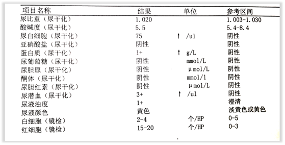
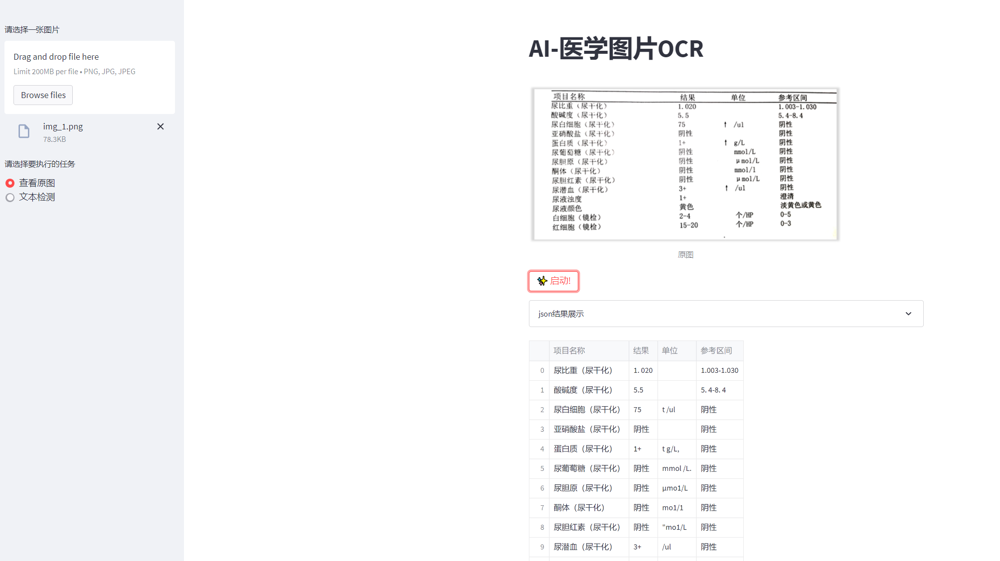

## 医学图片的ocr识别
### 背景
该项目主要使用百度的paddleocr对医学图片进行识别。利用PPStructure对识别的内容进行结构化，最终将结构化的内容保存成csv文件。
整个项目通过streamlit进行前端的展示。


### 数据形式


### 代码结构

```
├── AI-医学图片OCR.py  # 前端展示
├── ocr
│   ├── __init__.py  # 初始化
│   ├── ocr.py       # ocr识别
│   └── utils.py     # 一些工具函数
├── ocr_utils.py     # 一些工具函数
```


### 项目启动

```
streamlit run  AI-医学图片OCR.py
```


### 前端展示
* 前端展示地址：http://ip:8501


